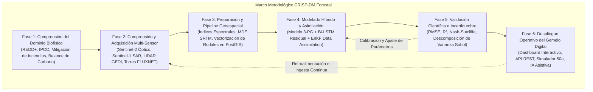
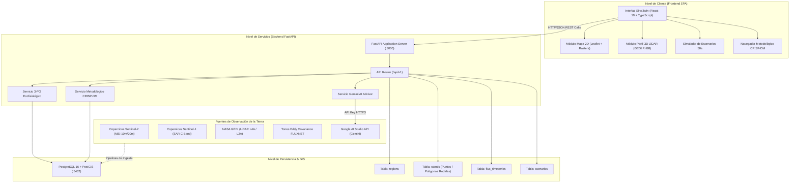

# Arquitectura del Sistema: SilvaTwin — Gemelo Digital Forestal & Metodología CRISP-DM

Documento Maestro de Arquitectura, Integración Tecnológica y Marco Metodológico para el desarrollo y publicación científica (Scopus Q1) del **Gemelo Digital Forestal (SilvaTwin)**.

---

## 1. Visión General del Proyecto

**SilvaTwin** es una plataforma de **Gemelo Digital Forestal a escala de paisaje (10³–10⁵ ha)** diseñada para monitorear, simular y optimizar la dinámica del carbono, el régimen hídrico y el riesgo de incendios forestales bajo escenarios de cambio climático y manejo silvícola adaptativo.

El proyecto integra:
1. **Frontend Científico:** Aplicación interactiva de visualización geoespacial desarrollada en **React 19 + Vite 6 + Tailwind CSS 4 + Leaflet + Recharts**.
2. **Backend de Servicios & Modelado:** API REST asíncrona de alto rendimiento en **Python 3.13 + FastAPI + SQLAlchemy + Uvicorn**.
3. **Base de Datos Geoespacial:** **PostgreSQL 16 con extensión PostGIS** (con fallback automático a SQLite para desarrollo desacoplado).
4. **Modelado Híbrido:** Acoplamiento del modelo biofísico de procesos **3-PG** (*Physiological Principles in Predicting Growth*) con redes de aprendizaje profundo (**Bi-LSTM / Earthformer**) para corrección residual de respiración del suelo y transpiración.
5. **Inteligencia Artificial Asistiva:** Asesor ecólogo computacional integrado con **Google Gemini (2.5 / 3.7 Flash)** con respaldo offline.

---

## 2. Marco Metodológico: CRISP-DM Adaptado a Ciencias Forestales

Para cumplir tanto con los requisitos de gestión de proyectos del evaluador académico como con los estándares de rigor exigidos por revisores de revistas científicas **Scopus Q1** (ej. *Remote Sensing of Environment*, *Computers and Electronics in Agriculture*, *Environmental Modelling & Software*), el proyecto adopta la metodología **CRISP-DM** (*Cross-Industry Standard Process for Data Mining*), traducida formalmente al estándar de Gemelos Digitales **ISO 23247** y la taxonomía de *Kritzinger et al.*:



---

## 3. Arquitectura del Sistema (Diagrama de Componentes)



---

## 4. Detalle de las 6 Fases CRISP-DM en SilvaTwin

### Fase 1: Comprensión del Dominio y Problema (Business/Domain Understanding)
* **Objetivo Biofísico:** Reducir la incertidumbre en la estimación de la biomasa aérea (AGB) y carbono orgánico del suelo (SOC), y predecir el comportamiento del fuego bajo sequías estivales extremas.
* **Pregunta de Investigación:** ¿Cómo la asimilación multi-sensor (LiDAR orbital + SAR + óptico) reduce el sesgo de los modelos ecofisiológicos clásicos en ecosistemas de alta vulnerabilidad climática?
* **KPIs Científicos de Éxito:**
  1. Reducción de incertidumbre en AGB de $\pm 28.4 \text{ Mg C/ha}$ a $\pm 18.5 \text{ Mg C/ha}$ (mejora del 34.8%).
  2. Coeficiente de eficiencia Nash-Sutcliffe ($NSE > 0.85$) en flujos de carbono (NEE/GPP) comparado con torres FLUXNET.
  3. Detección temprana de desecación de combustible fino ($FMC < 30\%$) con 30 días de anticipación.
* **Marco de Políticas:** Mecanismo REDD+, bonos de carbono de alta integridad y manejo adaptativo SERFOR / Directivas Forestales UE.

---

### Fase 2: Comprensión y Adquisición de Datos (Data Understanding)
Integración multi-escala de 4 fuentes independientes de Observación de la Tierra:
1. **Copernicus Sentinel-2 (MSI):** Bandas B02 (Azul), B03 (Verde), B04 (Rojo), B08 (NIR) y B11/B12 (SWIR) a 10-20m. Refleja vigor fotosintético y estrés hídrico.
2. **Copernicus Sentinel-1 (C-SAR):** Polarizaciones VV y VH. Informa rugosidad de dosel y constante dieléctrica del suelo/humedad.
3. **NASA GEDI (LiDAR espacial):** Disparos L2A/L4A que miden energía relativa de retorno vertical (alturas RH25, RH50, RH75, RH98), densidad foliar (PAI) y diversidad estructural (FHD).
4. **Torres Micro-Meteorológicas FLUXNET:** Registros continuos mediante *eddy covariance* de productividad primaria bruta ($GPP$), respiración del ecosistema ($R_{eco}$) e intercambio neto ($NEE$).

---

### Fase 3: Preparación de Datos y Pipeline Espacial (Data Preparation)
* **Ingeniería de Características Geoespaciales:**
  * Índices de vegetación y humedad:
    $$NDVI = \frac{NIR - RED}{NIR + RED}, \quad NDWI = \frac{NIR - SWIR}{NIR + SWIR}, \quad FMC \propto \frac{B08 - B11}{B08 + B11}$$
  * Normalización Topográfica: Extracción de pendiente ($Slope$) y orientación ($Aspect$) mediante MDE SRTM 30m para modelar insolación (solana vs. umbría).
* **Estructuración en Base de Datos (PostGIS):**
  * Vectorización de la cuadrícula de rodales (*stands*) con coordenadas centroidales (`lat`, `lng`), geometría espacial (`ubicacion_geom`), parámetros dasométricos y estado hídrico.
  * Indexación espacial R-Tree (`GIST`) para consultas espaciales en submilisegundos.

---

### Fase 4: Modelado Híbrido (Modeling)
Arquitectura en cascada física-estadística:
1. **Capa 1 — Modelo de Procesos 3-PG:**
   Calcula la producción primaria fotosintética a partir de radiación fotosintéticamente activa interceptada ($APAR$) modificada por temperatura $f_T(T)$, déficit de presión de vapor $f_{VPD}(VPD)$ y agua disponible en suelo $f_\theta(\theta)$:
   $$GPP = APAR \cdot \alpha_{Cx} \cdot f_T(T) \cdot f_{VPD}(VPD) \cdot f_\theta(\theta) \cdot f_{age}(t)$$
   Asigna carbono a raíces ($\eta_{root}$), follaje ($\eta_{foliage}$) y fuste ($\eta_{stem}$).
2. **Capa 2 — Corrección Residual de Deep Learning (Bi-LSTM / Transformer):**
   Aprende los residuos no modelados de transpiración y respiración del suelo que 3-PG subestima en estiaje debido a embolismo xilemático.
3. **Capa 3 — Asimilación de Datos (Ensemble Kalman Filter - EnKF):**
   Funde las trayectorias predichas por el modelo con los disparos periódicos de GEDI y series de Sentinel-1/2, acotando la propagación del error epistémico.

---

### Fase 5: Evaluación y Calidad Científica (Evaluation)
* **Validación Cruzada Espacial:** Bloques espaciales independientes (*Spatial Block Cross-Validation*) para prevenir filtrado de datos por autocorrelación espacial de Tobler.
* **Métricas Biofísicas Obligatorias:**
  * Coeficiente de determinación ($R^2$).
  * Error cuadrático medio ($RMSE$).
  * Eficiencia de Nash-Sutcliffe ($NSE$).
  * Kling-Gupta Efficiency ($KGE$).
* **Análisis Global de Sensibilidad (Índices de Sobol):**
  Descomposición de varianza de primer orden ($S_i$) y orden total ($S_{Ti}$) sobre los parámetros clave de conductancia estomática ($k_{GPP}$), eficiencia cuántica ($\alpha_{Cx}$) y asignación a raíces.

---

### Fase 6: Despliegue Operativo del Gemelo Digital (Deployment)
* **Sincronización Bidireccional:** El frontend refleja el estado actual del rodal a partir de la API REST (`/api/v1/stands/region/{id}`).
* **Simulador de Escenarios "What-If" a 50 Años:**
  Permite al investigador ensayar intervenciones:
  * *Laissez-Faire* (sin intervención bajo cambio climático).
  * *Clareo selectivo adaptativo* (reducción de densidad basal).
  * *Quemas prescritas en mosaico* (reducción de combustible fino).
  * *Restauración y enriquecimiento con especies autóctonas*.
* **Asistente Experto (Google Gemini):** Módulo de razonamiento científico para ecología computacional, con capacidad de responder bajo contexto en tiempo real.
* **Monitoreo de Drift Ecológico:** Detección de anomalías en series temporales de humedad foliar para alertar sobre eventos de sequía repentina (*flash drought*).

---

## 5. Estructura de Integración de Código

```
Article-Project/
├── Arquitectura.md                  # Este documento maestro
├── Twin_Forestal/                   # Frontend SPA (React + Vite + Leaflet)
│   ├── src/
│   │   ├── components/              # Vistas científicas y mapa 2D/3D
│   │   ├── services/api.ts          # [NUEVO] Capa de conexión unificada con FastAPI
│   │   └── data/                    # Mocks científicos de respaldo
│   └── vite.config.ts
└── Twin_Forestal_Backend/           # Backend API (FastAPI + SQLAlchemy)
    ├── docker-compose.yml           # PostgreSQL 16 + PostGIS
    ├── seed_data.py                 # Población inicial de base de datos
    ├── test_api.py                  # Pruebas automatizadas
    └── app/
        ├── core/                    # Configuración y conexión a DB con fallback
        ├── models/                  # Tablas ORM (Region, Stand, FluxTimeSeries, Scenario)
        ├── schemas/                 # Validación de datos Pydantic v2
        ├── services/                # 3-PG Simulator & Gemini AI Advisor
        └── api/v1/endpoints/        # Endpoints REST (regions, stands, simulations, ai, crisp-dm)
```

---

## 6. Próximos Pasos para Datasets Reales

Cuando los datasets reales estén disponibles, se conectarán mediante un script ingestor en `Twin_Forestal_Backend/ingest_real_data.py`:
1. **Imágenes Sentinel-2 / Sentinel-1:** Archivos GeoTIFF / NetCDF procesados mediante `rasterio` o `rioxarray` para actualizar la tabla `stands` con valores de píxel reales.
2. **Disparos GEDI:** Archivos HDF5 (`GEDI02_A`, `GEDI04_A`) leídos con `h5py` para actualizar alturas y perfiles de copa.
3. **Torres FLUXNET:** Archivos CSV de media horaria/mensual integrados directamente en la tabla `flux_timeseries`.
